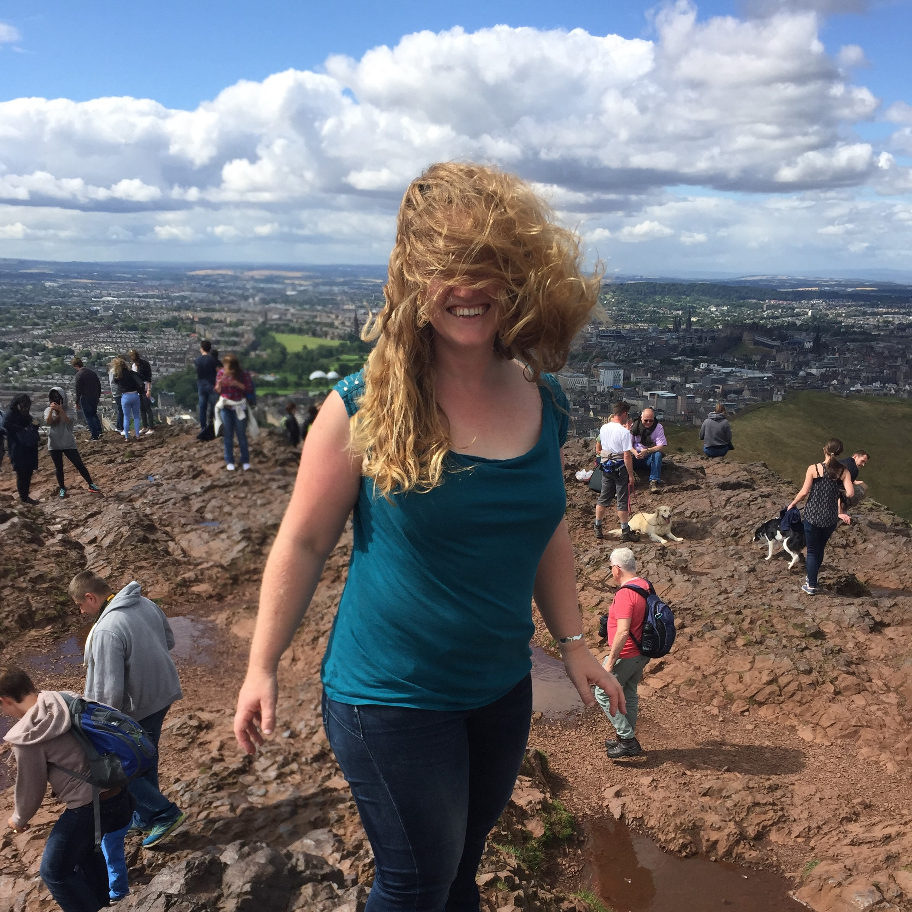
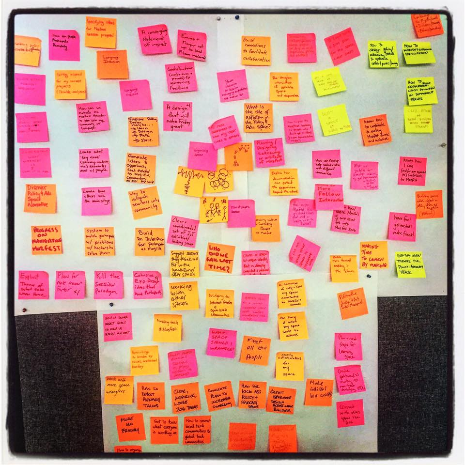

> **tl;dr**: [Apply today](https://science.mozilla.org/programs/fellowships). It will change your life  (even if you aren't selected!)
>
> **Deadline: 14th May**

I first heard about the Mozilla fellows for science program in 2015. My first, and only, response was "This was made for me"!

When I finished my PhD in Neuroscience from the University of California at Berkeley, I was so frustrated with the academic reward system. Specifically, I had found many null results during the five years of my PhD, and I had also failed to replicate some already published findings. I knew others had had the same experience, but we weren't writing up our efforts, we kept going back to the drawing board to find sufficiently *novel* and *significant* results so we could graduate.

I didn't want to give up on doing science for a career though. A good day in science - where you get to talk with super smart and thoughtful people about how the brain works, develops, learns and evolves, is one of the very best ways to spend your time. The problem is simply that so many of these smart people leave academia to a) be paid more, b) maintain a better work-life balance, and c) have clearer goals and expectations.

The [Mozilla fellows for science](https://science.mozilla.org/programs/fellowships) program is an investment in the future of science. It has brought me hope and inspiration to support the next generation of scientists. People who collaborate rather than compete, who accept that we make mistakes and that our theories evolve, and who believe that by sharing our work we can build something so much better that we each could create alone.

In this blog post I'm going to talk you through my application journey. Please reach out (I'm [@kirstie_j](https://twitter.com/kirstie_j) on twitter) if you have any questions or comments.

### My first - unsuccessful - MozFellows application

I submitted my [2015 application](https://whitakerlab.github.io/resources/Mozilla-Science-Fellowship-Application-2015/) while I was on holiday in Edinburgh with friends. Hiking up Arthur's Seat the following (very windy) day felt really great.

*Celebrating my first Mozilla fellowship application with a windy hike in Edinburgh*

I got through to the final round in 2015. That meant I had interviews with [Kaitlin Thaney](https://twitter.com/kaythaney), [Zannah Marsh](https://twitter.com/zannahlou), [Abby Cabunoc Mayes](https://twitter.com/abbycabs), and [Arliss Collins](https://twitter.com/arlissc99). They were all *so amazing* I left every conversation desperate to work with them.

I didn't end up being chosen, but I was still really inspired to join a community I felt were able to make a difference in the lives of early career researchers around the world.

This is my answer to the question "Why is the open web important to you?", from my [2015 application](https://whitakerlab.github.io/resources/Mozilla-Science-Fellowship-Application-2015/),

> The open web is the great equaliser. It doesn’t matter where you come from, your gender, sexual orientation or race: the open web allows you to meet peers, mentors, role models and friends. Academia is competitive and, sometimes, dangerously isolating. The mental health challenges for highly educated “trainees” is often not appreciated by those in power and the “crushing self-doubt” of the imposter complex pervades our halls. The open web allows science to advance by sharing our deeper understandings (rather than only the novel or unexpected results) and by supporting the real human beings who undertake those analyses every day.

### MozFest 2015

I'm not going to lie, I was pretty nervous heading to [MozFest](https://www.theguardian.com/info/developer-blog/live/2015/nov/07/live-from-mozfest-2015) in November 2015. I knew I should go - I don't live far from London and it was going to be an excellent weekend event - but I was also going to have to be brave and meet the four successful fellows without appearing too jealous! :unamused:

Fortunately, it was easy. The atmosphere at MozFest was enthusiastic and friendly. I partly blended in with the crowd and partly chatted with lovely people. I immediately felt like I'd joined a community of like-minded friends.

My fortune cookie even supported my life view that file organisation is ***super freaking important***!

*My MozFest 2015 fortune*

The workshops in the Open Science space were amazing. My favourite was Pull Request bingo lead by [Mu-An Chiou](https://twitter.com/muanchiou). (That was my very first experience with collaborating via GitHub!)

<blockquote class="twitter-tweet" data-lang="en">
OMG <a href="https://twitter.com/hashtag/pullrequestbingo?src=hash">#pullrequestbingo</a> went swimmingly at <a href="https://twitter.com/hashtag/mozfest?src=hash">#mozfest</a>, check out this glorious list of PRs! 💥 <a href="https://t.co/gOT6rzNHHC">https://t.co/gOT6rzNHHC</a> <a href="https://t.co/evVL2JIdKq">pic.twitter.com/evVL2JIdKq</a>
&mdash; muan @ berlin too (@muanchiou) <a href="https://twitter.com/muanchiou/status/662961534088388608">November 7, 2015</a></blockquote>

### Working Open Workshop in Berlin, February 2016 and Open Leadership Cohort mentorship

The coolest part of being rejected from the Mozilla Fellowship program in 2015 was being invited to their very first [Working Open Workshop](https://science.mozilla.org/programs/events/working-open-workshop-february-2016) in February 2016.

It was outstanding. I met the other 30 members of the Open Leadership Cohort and we all supported each other in developing our projects. I brought with me the STEMM Role Models project which had just been selected as finalist for the [Rosalind Franklin appathon](http://www.rfappathon.org/about_entries).

<iframe width="560" height="315" src="https://www.youtube.com/embed/A60pq3pzSWU?ecver=1" frameborder="0" allowfullscreen></iframe>

At the Berlin WOW I build up our project's GitHub repository. We learned about the importance of welcoming people to your project (the almighty [README.md](https://github.com/KirstieJane/STEMMRoleModels/blob/gh-pages/README) welcome mat), giving clear guidelines on how to contribute ([CONTRIBUTING](https://github.com/KirstieJane/STEMMRoleModels/blob/gh-pages/CONTRIBUTING.md)) and on community norms ([CODE_OF_CONDUCT](https://github.com/KirstieJane/STEMMRoleModels/blob/gh-pages/CODE_OF_CONDUCT.md)).

After I came home from Berlin I had fortnightly meetings with Abby and [Aurelia](https://twitter.com/auremoser) - my Mozilla Science lab mentors - who held my hand and supported me all the way through to the Global Sprint....where the STEMM Role Models team of contributors made our very first [website](http://stemmrolemodels.com/) and database! Meeeep! :tada: :heart_eyes: :sparkles:

### MozFest Retreat in Berlin, May 2016

In May 2016 I was invited to help out organising (wrangling) the Open Science space at MozFest 2016. The three day retreat in Berlin with Arliss, Joey and Richard, along with the other Mozilla space wranglers was exceptional.

We spent three days talking about our hopes and dreams for MozFest. We were completely focused on building an event that could bring together advocates for the open web, and support Mozilla's mission to ensure that everyone has access to this incredible resource.

I'd never seen so many postit notes before that retreat, but I have since! I'm completely sold on the benefits of staying up above the nitty-gritty and thinking big. Focusing on our shared goals let us develop the biggest MozFest to date, and I've tried to bring some of the meeting management techniques from the retreat to project meetings for my other collaborations.

*Our postit board from discussions at the MozFest retreat in Berlin*

### My second - successful :tada: - MozFellows application

One year later, here I was, ready to submit a second [Mozilla Fellowship application](https://whitakerlab.github.io/resources/Mozilla-Science-Fellowship-Application-2016/). I had built up some incredible experiences and I had a project that showed my dedication to working open. That didn't mean I was a sure thing by any means, but I knew that there was no downside to trying again.

Here's my answer to the question "What do you think needs to change most immediately in scientific research?":

> We must incentivise the measurement of the reproducibility and replicability of scientific findings. We should preregister our analyses, publish null results and ensure that researchers are rewarded for rigour rather than novelty. The scientific method is defined by the constant testing, updating and integration of previously acquired knowledge and it is essential we return to that philosophy. At a minimum, raw data, analysis code and instructions to recreate figures need to be made available to reviewers with all submitted journal articles. More extensively, we must better reward the people who build, develop and document tools to facilitate this process.

I again had three sets of interviews, and my supervisor was even interviewed to check that he was supportive of spending my time as a Mozilla fellow for science. Everyone was really great (again) and I was over the moon when I received an email from Aurelia with the subject line: **2016 Mozilla Fellowships for Science: Congratulations!**

*The congratulations cupcake that my lovely boyfriend bought for me when I was selected to be Mozilla fellow for science in August 2016*

### The whirlwind that has been the last 9 months

This post is already too long, so I'm just going to bullet point *some* of the adventures that I've had as Mozilla Fellow for Science.

* [Fellows onboarding](https://science.mozilla.org/blog/2016-fellows-onboarding-recap) in Toronto
* [MozFest](https://mozillafestival.org/) in London
* [OpenCon](http://www.opencon2017.org) in Washington DC
* [CBU open science workshop](http://www.mrc-cbu.cam.ac.uk/openscience2016/) in Cambridge
* [OpenCon Cambridge](http://www.opencon2017.org/opencon_2016_cambridge)
* [Research software management, sharing and sustainability workshops](https://doi.org/10.17863/CAM.7178) in Cambridge and London
* [Friendly git and GitHub workshops](https://kirstiejane.github.io/friendly-github-intro/) in Cambridge
* [Fellows workweek](https://science.mozilla.org/blog/mozfellows-workweek) in San Francisco
* [OpenCon SF](https://science.mozilla.org/blog/mozfellows-at-opencon-sf)
* [Cambrainhack](https://cambrainhack.github.io/), part of [Brainhack Global](http://www.brainhack.org/global2017/), in Cambridge
* Collaborations with two theatre companies in London
* Visit to Mackey lab at U Penn in Philadelphia
* Science March in DC
* [microWOW](https://whitakerlab.github.io/blog/London-MicroWOW/) in London
* [Mozilla Global Sprint](https://mozilla.github.io/global-sprint/) in San Francisco
* Fellows offboarding in Cape Town
* miniWOW at OHBM Hackathon in Vancouver

### Take home message

***Oh my goodness, please [apply](https://science.mozilla.org/programs/fellowships).***

This blog post is so close to this year's deadline (**14th May**) because I find it so hard to put into words how much my membership of the Mozilla Science community has changed my life.

* I've made friends
* I've been mentored
* I've mentored others
* I've laughed
* I've cried
* I've felt overwhelmed
* **I've felt inspired**

***We can do this.***

We are the future of science. **You** are the future of science. Don't let anyone tell you that there are games you have to play because "that's the way it works".

Be the change you want to see in the world, and let all the wonderful folk at the Mozilla Science lab help you on that journey!

*2016 Mozilla fellows for science and open web fellows at their onboarding in Toronto. Picture stolen from Aurelia's post [Seeking Open Science Fellows](https://medium.com/read-write-participate/seeking-open-science-fellows-d0cf1dd6fbf0) on Medium*

> Applications close on 14th May 2017.
>
> You can find all the details you need to apply at [https://science.mozilla.org/programs/fellowships](https://science.mozilla.org/programs/fellowships)
